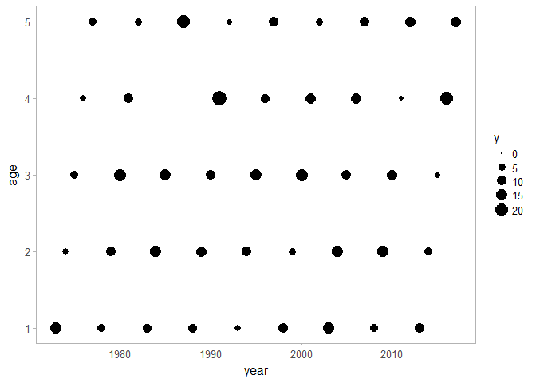
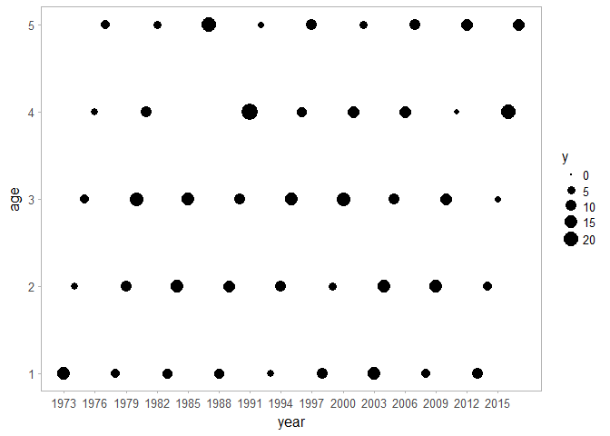
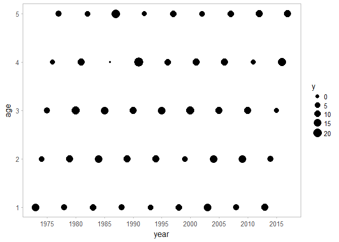

You can download this repository using devtools

```{r}
# install.packages("devtools")
devtools::install_github("ben-williams/FNGr")
```
Then load the package per usual

``` r
library(FNGr)
library(tidyverse)
library(scales)
```

First set the "universal" figure theme to `theme_sleek()`

```{r}
theme_set(theme_sleek())
```

Create data for this example

```{r}
data.frame(year = 1973:2017, age = 1:5) %>%
  mutate(y = rnorm(n(), 10,5)) -> df
```

The basic ggplot figure spaces years about every 5-10, depending on the timeseries length.

``` r
ggplot(df, aes(year, age, size = y)) + geom_point()  + scale_size_area()
```



This makes for a rather poor axis, for our typical presentation needs. We can clean this up somewhat by using breaks or the pretty\_breaks function from the scales package

``` r
ggplot(df, aes(year, age, size = y)) + geom_point() + scale_size_area() +
    scale_x_continuous(breaks = seq(1973, 2016, 3))
```



``` r

ggplot(df, aes(year, age, size = y)) + geom_point() +
  scale_x_continuous(breaks = pretty_breaks(n = 15))
```



However this does not show a tick for each year, something that has been regularly requested. tickr will add a tick mark to each year and provide a label for the interval designated.

Labels every 10 years.

``` r
xaxis = tickr(df, year, 10)
yaxis = tickr(df, age, 2)

ggplot(df, aes(year, age, size = y)) + geom_point() +
  scale_x_continuous(breaks = xaxis$breaks, labels = xaxis$labels) +
  scale_y_continuous(breaks = yaxis$breaks, labels = yaxis$labels)
```


